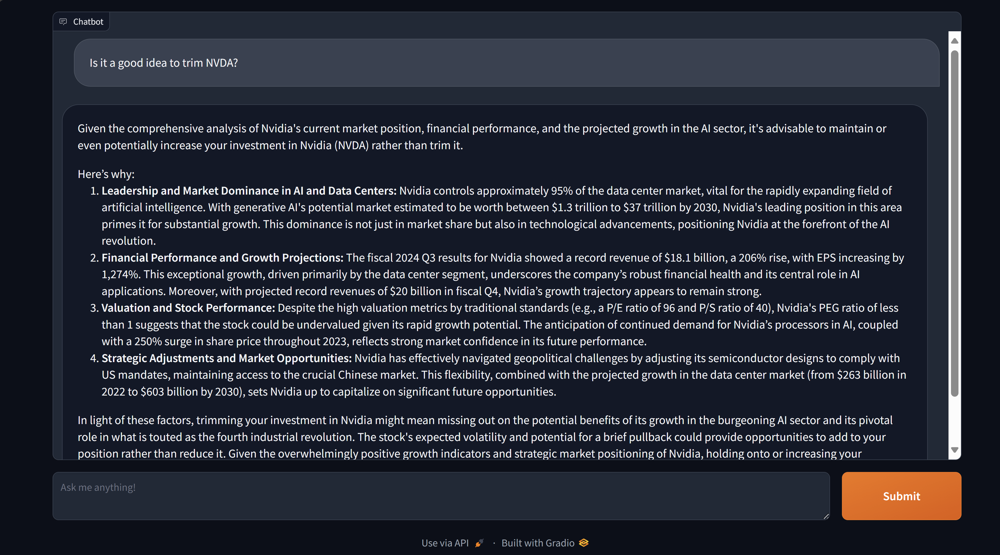

# Jarvis

RAG with wealth management data.



## Developer

1. Pre-requisites: Python3.10, Poetry
2. Create a poetry shell and install the depedencies
```
$ poetry shell
$ poetry install
```
3. Copy `env.template` to `.env` and update it's values. (Note: Debug=True will show the prompt that is being passed to the LLM)
```
$ cat .env
OPENAI_API_KEY=
DEBUG=False
```
4. Create data by adding markdown files in `data/raw` and then running the test case `processor_check.py`
```
$ poetry run python3 -m unittest tests.processory_check
```
5. Run the Gradio app
```
$ poetry run python3 -m jarvis.app
```